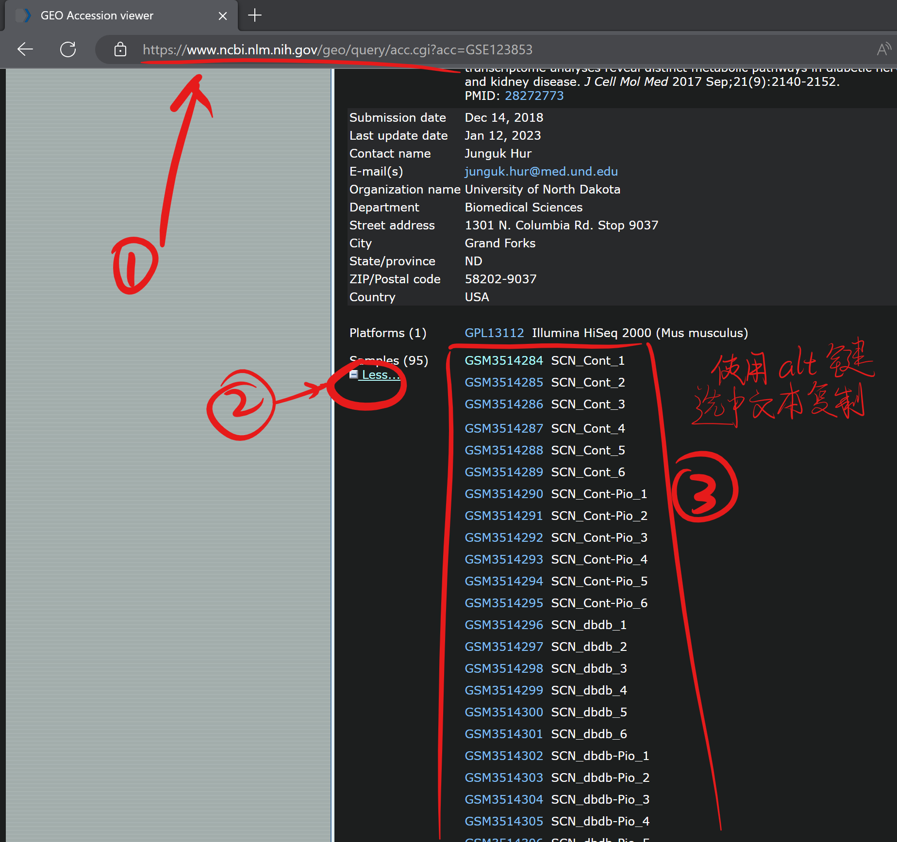
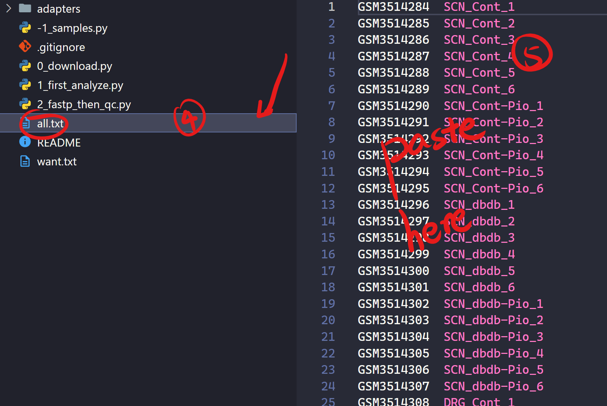
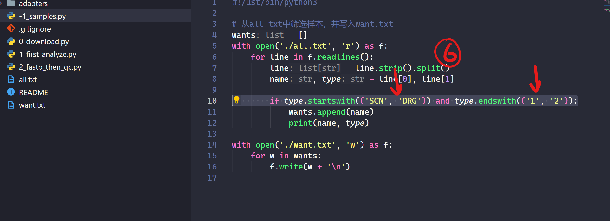
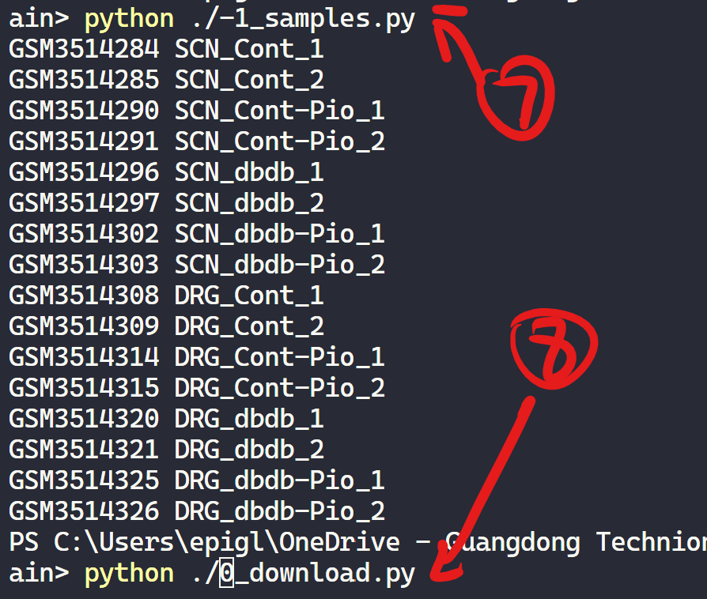
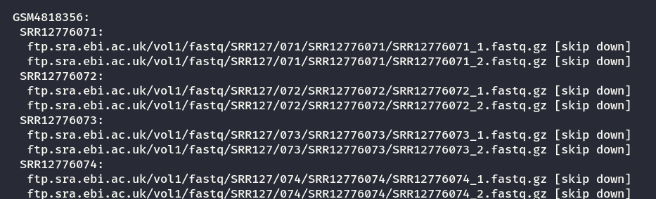
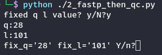

You need install 
fastqc
fastp
aria2c

pip install requests

Visit [GEO](https://www.ncbi.nlm.nih.gov/geo/query/acc.cgi?acc=GSE159060) and

It will skip which already done.

Then directly run `2_fastp_then_qc.py`

If you want to use fixed values, input here.

